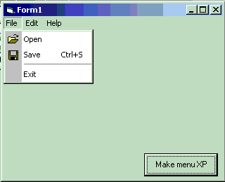



## xp style menus

### Description

this code is a slight modification of the menu ocx. created by vbaccelerater. it give menus a windows xp appearance. it does this by placing a background image, chnaging the starting position of the menu separator line and changing the color of the highlight. you will need the subtimer dll, i have included it in the zip file along with the original vbacceletor code. please do not vote for me since this is really not my code. enjoy.
 
### More Info
 

             |
---                |---
**Submitted On**   |2001-08-25 11:55:00
**By**             |[gandu](https://github.com/Planet-Source-Code/PSCIndex/blob/master/ByAuthor/gandu.md)
**Level**          |Advanced
**User Rating**    |5.0 (35 globes from 7 users)
**Compatibility**  |VB 5\.0, VB 6\.0
**Category**       |[Custom Controls/ Forms/  Menus](https://github.com/Planet-Source-Code/PSCIndex/blob/master/ByCategory/custom-controls-forms-menus__1-4.md)
**World**          |[Visual Basic](https://github.com/Planet-Source-Code/PSCIndex/blob/master/ByWorld/visual-basic.md)
**Archive File**   |[xp style m253188252001\.zip](https://github.com/Planet-Source-Code/gandu-xp-style-menus__1-26636/archive/master.zip)

